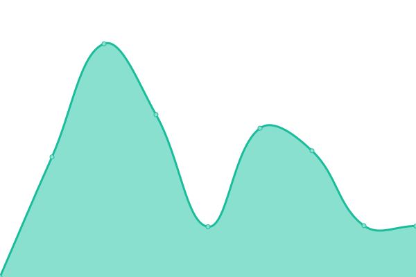
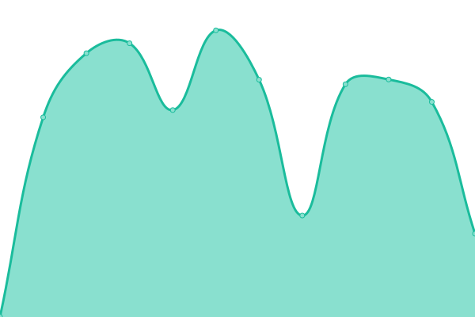
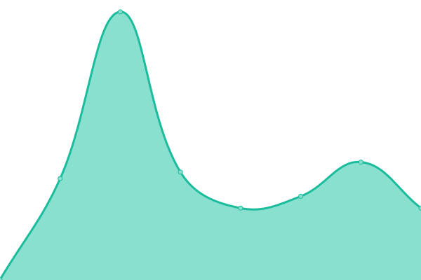
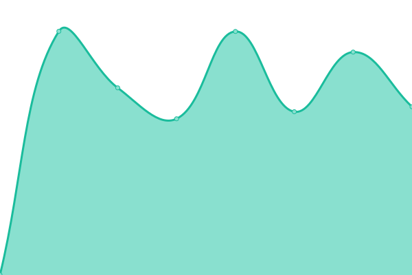

# [📈 Live Status](https://alexanderhodes.github.io/upptime-demo): <!--live status--> **🟧 Partial outage**

This repository contains the open-source uptime monitor and status page for [Alexander Hodes](https://alexanderhodes.de), powered by [Upptime](https://github.com/upptime/upptime).

With [Upptime](https://upptime.js.org), you can get your own unlimited and free uptime monitor and status page, powered entirely by a GitHub repository. We use [Issues](https://github.com/alexanderhodes/upptime-demo/issues) as incident reports, [Actions](https://github.com/alexanderhodes/upptime-demo/actions) as uptime monitors, and [Pages](https://alexanderhodes.github.io/upptime-demo) for the status page.

<!--start: status pages-->
<!-- This summary is generated by Upptime (https://github.com/upptime/upptime) -->
<!-- Do not edit this manually, your changes will be overwritten -->
<!-- prettier-ignore -->
| URL | Status | History | Response Time | Uptime |
| --- | ------ | ------- | ------------- | ------ |
|  [Suite](https://suite.isar-labs.com) | 🟩 Up | [suite.yml](https://github.com/alexanderhodes/upptime-demo/commits/HEAD/history/suite.yml) | 

 1064ms
     
 | 

<a href="https://status.alexanderhodes.de/history/suite">100.00%</a>
    

|  [Construction Documentation](https://construction-documentation.isar-labs.com) | 🟩 Up | [construction-documentation.yml](https://github.com/alexanderhodes/upptime-demo/commits/HEAD/history/construction-documentation.yml) | 

 850ms
     
 | 

<a href="https://status.alexanderhodes.de/history/construction-documentation">100.00%</a>
    

|  [Document Workflow](https://document-workflow.isar-labs.com) | 🟩 Up | [document-workflow.yml](https://github.com/alexanderhodes/upptime-demo/commits/HEAD/history/document-workflow.yml) | 

 839ms
     
 | 

<a href="https://status.alexanderhodes.de/history/document-workflow">100.00%</a>
    

|  [Vercel (third party)](https://www.vercel-status.com/api/v2/summary.json) | 🟩 Up | [vercel-third-party.yml](https://github.com/alexanderhodes/upptime-demo/commits/HEAD/history/vercel-third-party.yml) | 

 2612ms
     
 | 

<a href="https://status.alexanderhodes.de/history/vercel-third-party">98.32%</a>
    

|  [Trigger.dev (third party)](https://status.trigger.dev) | 🟩 Up | [trigger-dev-third-party.yml](https://github.com/alexanderhodes/upptime-demo/commits/HEAD/history/trigger-dev-third-party.yml) | 

 1213ms
     
 | 

<a href="https://status.alexanderhodes.de/history/trigger-dev-third-party">96.86%</a>
    

|  [Neon (third party)](https://neonstatus.com/aws-us-east-n-virginia) | 🟥 Down | [neon-third-party.yml](https://github.com/alexanderhodes/upptime-demo/commits/HEAD/history/neon-third-party.yml) | 

 515ms
     
 | 

<a href="https://status.alexanderhodes.de/history/neon-third-party">51.95%</a>
    

<!--end: status pages-->

[**Visit our status website →**](https://alexanderhodes.github.io/upptime-demo)

## 📄 License

- Powered by: [Upptime](https://github.com/upptime/upptime)
- Code: [MIT](./LICENSE) © [Anand Chowdhary](https://anandchowdhary.com), supported by [Pabio](https://pabio.com)
- Data in the `./history` directory: [Open Database License](https://opendatacommons.org/licenses/odbl/1-0/)
